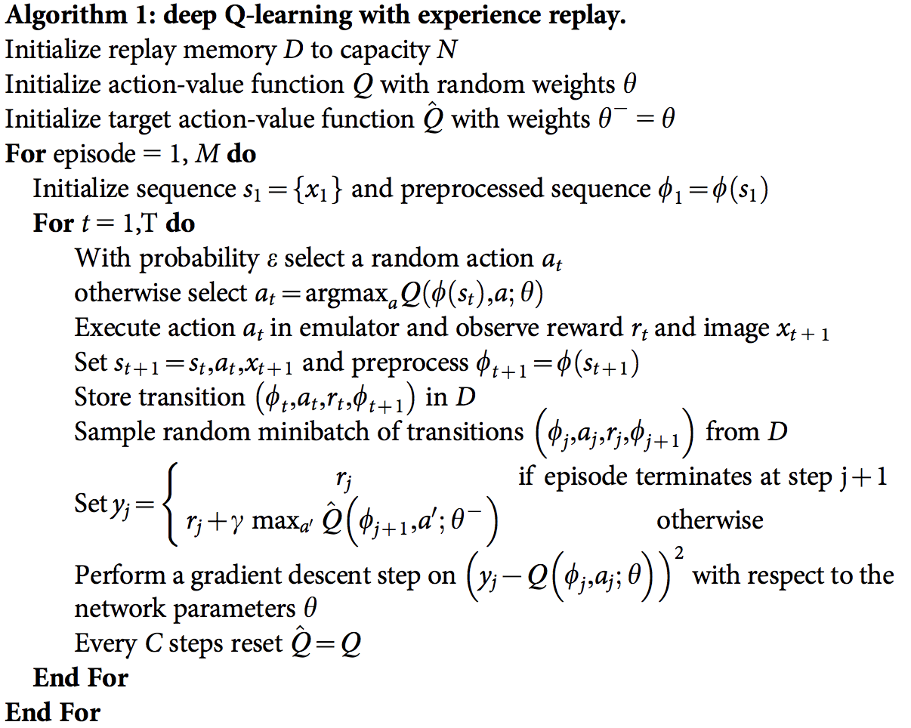

# Method
For the training of the agent, DQN algorithm is used with the following settings:
- Replay buffer size = 1e5
- Mini batch size = 64
- Replay buffer with uniform sampling
- Learning rate: 5e-4
- Update network: every 4 steps
- gamma: 0.99
- epsilon decay method: eps_start=1.0, eps_end=0.01, eps_decay=0.995
- Maximum number of steps per episode = 1000

# DQN ([Paper](https://storage.googleapis.com/deepmind-media/dqn/DQNNaturePaper.pdf))

The DQN implementation is in [dqn_agent.py](dqn_agent.py).

# Neural Network Architecture
The model architecture is in [model.py](model.py). It consists of two fully connected layers with the size 64 and 64. The input is state and the output is the action number. The used activation function is Relu.

# Results
Here is the plot that shows the score and scores mean per window of the agent in different episodes. 

The agent is able to solve the environment in 398 episodes.

Episode 100	Average Score: 1.19  
Episode 200	Average Score: 4.93  
Episode 300	Average Score: 8.19  
Episode 400	Average Score: 10.85  
Episode 498	Average Score: 13.01  

Environment solved in 398 episodes!	Average Score: 13.01

# Future works
- One potential future work is to train the agent with raw pixels. To do so, there is a need of defining layers of CNN before the fully connected layers in the model for feature extraction. 
- Instead of sampling uniformly from the replay buffer, we can use prioritized experience replay that is more helpful than the current method since the valuable replays would have better chances to be selected and better for the network to be trained with them. In general, it could mean that the agent learns better from the important replays.
- Using Double DQN to avoid overestimation (positive-biased). In vanilla DQN, the agent in the initial stages of training makes decisions based on the value of the Q-network that has not been yet converged to the actual value. Double DQN would help to solve this issue.

